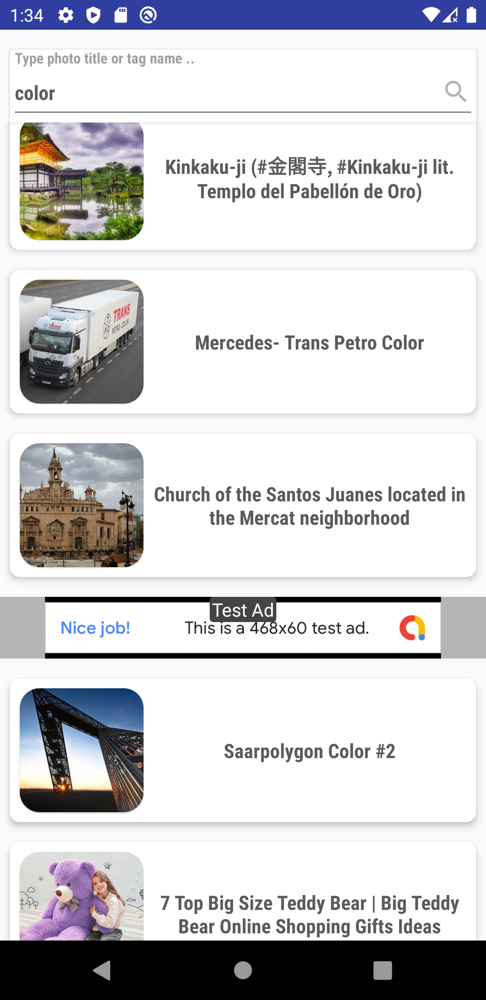

# FlickrSearchApp
 A demo Android app uses Flickr search API to display a list of photos
## The demo works as follow :
1. The home screen displays a paginated list of photos with their title according to the user's entered search input (handles both error and loading states) with a retry button
2. The photo preview screen which displays the clicked photo item in a single view 

## Architecture pattern: 
MVVM single activity architecture following the Data-Domain-Presentation clean architecture and the UDF unidirectional data flow pattern with repository pattern for data as a layer over different offline/online data sources

## Libraries and dependencies:
1. Constraint Layout for flexible relative positioning and sizing of views
2. Support for different English/Arabic local
3. Coroutines and flow for asynchronous operations (networking or data store operations)
4. Both data binding and view binding for binding viewmodel data to views
5. glide for image loading
6. Room offline database
7.  Navigation component for handling transitions between fragments
8.  Savedstatehandle module for holding state variables like search query
9.  Recyclerview with PagingDataAdapter
10.  Dagger-Hilt for dependency injection
11.  Retrofit/okhttp for networking
12.  Paging3 for supporting pagination

## Screenshots:

<kbd></kbd>
<kbd></kbd>
